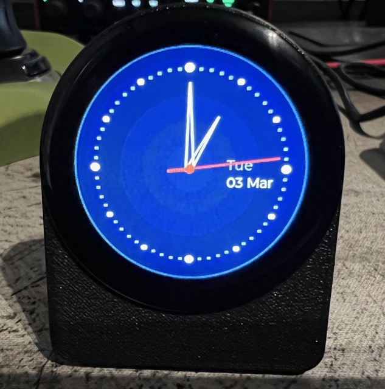

# ESP32 Analog Clock

A WiFi-connected NTP analog clock built on the ESP32-2424S012 development board, featuring a 1.28" round GC9A01 IPS display, capacitive touch, and a clean LVGL watch face.



## Features

- Analog clock face with smooth sweeping seconds hand (100ms updates)
- Hollow outline hour and minute hands with seconds counterbalance tail
- 60-dot border with size hierarchy (minute, 5-minute, quarter-hour)
- Subtle radial gradient background
- Day and date display at 3 o'clock position
- WiFi connectivity with NTP time synchronisation
- Configurable UTC offset, NTP server, and WiFi credentials
- AP mode web portal for initial setup and credential changes
- Swipe navigation (left → settings, right → clock face)
- Brightness control with PWM, persisted across reboots
- All settings stored in NVS (Non-Volatile Storage)

---

## Hardware

| Component | Details |
|-----------|---------|
| Board | ESP32-2424S012 |
| MCU | ESP32-C3-MINI-1U (single core RISC-V, 4MB flash) |
| Display | 1.28" round IPS TFT, 240×240, GC9A01 driver |
| Touch | CST816S capacitive touch controller |

### Pin Mapping

| Function | GPIO |
|----------|------|
| Display SCLK | IO6 |
| Display MOSI | IO7 |
| Display CS | IO10 |
| Display DC | IO2 |
| Display RST | EN (hardware reset) |
| Backlight | IO3 (PWM via LEDC) |
| Touch SDA | IO4 |
| Touch SCL | IO5 |
| Touch INT | IO0 |
| Touch RST | IO1 |

---

## Development Environment

- **OS:** macOS
- **IDE:** VSCode with ESP-IDF extension
- **Framework:** ESP-IDF 5.5.3
- **Additional component:** espressif/arduino-esp32 (via component manager)
- **Graphics:** LVGL v8 via esp_lvgl_port

---

## Project Structure

```
main/
├── main.cpp          — app_main, init sequence
├── display.cpp/.h    — SPI, GC9A01, LVGL init, PWM backlight
├── clock_face.cpp/.h — LVGL clock face, settings screen, gestures
├── touch.cpp/.h      — CST816S I2C touch driver
├── wifi_manager.cpp/.h — WiFi STA/AP, NTP, HTTP config portal
├── config.cpp/.h     — NVS read/write for all settings
├── CMakeLists.txt
└── idf_component.yml
```

---

## Getting Started

### 1. Prerequisites

- [VSCode](https://code.visualstudio.com/)
- [ESP-IDF VSCode Extension](https://marketplace.visualstudio.com/items?itemName=espressif.esp-idf-extension) (Express install, ESP-IDF 5.5.3)

### 2. Clone and open

```bash
git clone https://github.com/gbyleveldt/esp32-clock.git
cd esp32-clock
code .
```

### 3. Install dependencies

Open the ESP-IDF terminal (View → Terminal, select ESP-IDF Terminal) and run:

```bash
idf.py add-dependency "espressif/arduino-esp32"
idf.py add-dependency "lvgl/lvgl>=8.0.0,<9.0.0"
idf.py add-dependency "espressif/esp_lcd_gc9a01^1.0.0"
idf.py add-dependency "espressif/esp_lvgl_port^1.0.0"
idf.py add-dependency "espressif/esp_lcd_touch_cst816s^1.0.0"
```

### 4. Configure

```bash
idf.py menuconfig
```

Critical settings — **do not skip these:**

| Location | Setting | Value |
|----------|---------|-------|
| Component config → FreeRTOS → Kernel | configTICK_RATE_HZ | 1000 |
| Serial flasher config | Flash size | 4MB |
| Component config → LVGL | Ignore lv_conf.h | ☑ enabled |
| Component config → LVGL → Color settings | Swap the 2 bytes of RGB565 color | ☑ enabled |
| Component config → LVGL → Font usage | Montserrat 14 | ☑ enabled |

### 5. Build, flash and monitor

```bash
idf.py build flash monitor
```

### 6. First boot

On first boot with no saved credentials, the device will automatically start in AP mode. Connect to the `ESP32-Clock-Setup` WiFi network and open `http://192.168.4.1` in your browser to configure WiFi credentials, NTP server and UTC offset.

### 7. Enclosure

The `CAD/` folder contains STL files for a 3D printed case designed 
to fit the ESP32-2424S012 board. There's also a STEP file should you wish to make modifications. The prototype was printed in PLA. A future 
version will be machined in aluminium.

Printing notes:
- No supports required
- 0.2mm layer height recommended
- The display cutout is designed for a press fit
---

## Usage

### Clock face
The main screen shows the analog clock face with date display. The seconds hand updates every 100ms for a smooth sweep effect.

### Settings screen
Swipe **left** to open the settings screen. From here you can:
- Adjust display brightness (50–100%)
- Enter AP mode to reconfigure WiFi settings

Swipe **right** to return to the clock face. Brightness is saved to NVS on swipe back.

### AP mode
The config portal pre-populates all current settings. Leave the password field blank to keep the existing password.

---

## ⚠️ Known Gotchas and Pain Points

This section documents the non-obvious issues encountered during development. Future you will thank present you for reading this.

### CMake Tools extension conflict
The VSCode CMake Tools extension aggressively intercepts builds and uses the system clang toolchain instead of the ESP-IDF toolchain. This causes cryptic build failures.

**Fix:** Disable CMake Tools for the workspace (not globally).
In `.vscode/settings.json`:
```json
{
    "cmake.configureOnOpen": false
}
```
Or disable the CMake Tools extension per workspace via the Extensions panel.

### lv_conf.h is ignored by the ESP-IDF LVGL component
The LVGL component for ESP-IDF uses **Kconfig / menuconfig** for all configuration — it does not read `lv_conf.h`. Any settings you put in `lv_conf.h` will be silently ignored. The first option in the LVGL menuconfig section is literally a checkbox called "Ignore lv_conf.h" — make sure it is enabled.

**Fix:** All LVGL configuration (color depth, color swap, fonts, etc.) must be done through `idf.py menuconfig` under Component config → LVGL.

### RGB565 byte swap (colours completely wrong)
LVGL sends RGB565 pixel data with bytes in the wrong order for this display over SPI. This results in completely wrong colours — the dark navy background renders as washed-out green or purple.

**Fix:** Enable "Swap the 2 bytes of RGB565 color" in menuconfig under Component config → LVGL → Color settings. The menuconfig hint even says it is useful for 8-bit interfaces like SPI.

### LVGL fonts must be enabled in menuconfig
Only fonts explicitly enabled in menuconfig are compiled into the firmware. Referencing `lv_font_montserrat_16` when only `lv_font_montserrat_14` is enabled will cause a build error like:
```
error: 'lv_font_montserrat_16' was not declared in this scope;
did you mean 'lv_font_montserrat_14'?
```

**Fix:** Enable each required font size under Component config → LVGL → Font usage in menuconfig.

### FreeRTOS tick rate must be 1000Hz for Arduino component
The Arduino component requires FreeRTOS to be configured at 1000Hz. The default ESP-IDF tick rate is 100Hz, which causes timing issues with Arduino functions.

**Fix:** In menuconfig, set Component config → FreeRTOS → Kernel → configTICK_RATE_HZ to 1000.

### Serial.println() does not work on ESP32-C3
On the ESP32-C3, the USB Serial/JTAG interface conflicts with the Arduino `Serial` object when using ESP-IDF. `Serial.println()` will silently fail or corrupt output.

**Fix:** Use `ESP_LOGI(TAG, "message")` instead. It is actually superior — timestamped, log-level filtered, and visible in the ESP-IDF monitor.

### erase-flash wipes the bootloader
Running `idf.py erase-flash` wipes everything including the bootloader, leaving the device unable to enumerate a USB port. The device appears as busy or missing.

**Fix:** Hold BOOT, press and release RESET, then release BOOT to enter download mode manually. Then flash normally with `idf.py flash`.

### Custom partition table required
The default ESP-IDF partition table allocates only 1MB per app partition, which is too small for WiFi + LVGL + Arduino together.

**Fix:** Create a custom `partitions.csv` in the project root:
```
# Name,   Type, SubType, Offset,   Size,    Flags
nvs,      data, nvs,     0x9000,   0x5000,
phy_init, data, phy,     0xe000,   0x1000,
factory,  app,  factory, 0x10000,  0x3F0000,
```
Reference it in `CMakeLists.txt`:
```cmake
set(PARTITION_TABLE_CSV_PATH "${CMAKE_SOURCE_DIR}/partitions.csv")
```
Also set Flash size to 4MB in menuconfig under Serial flasher config.

### LVGL object minimum size and theme padding
LVGL's default theme applies hidden padding, minimum sizes, and shadows to `lv_obj` instances. This makes small objects (like 3–8px dots) appear misaligned because the rendered visual centre does not match the calculated position.

**Fix:** Use `lv_line` with `line_rounded=true` and a 1px length instead of `lv_obj` for small circular indicators. Setting the line width equal to the desired dot diameter produces a perfect circle with no padding or sizing interference:
```cpp
dot_pts[i][0] = {mx, my};
dot_pts[i][1] = {(lv_coord_t)(mx + 1), my};
lv_obj_t *dot = lv_line_create(parent);
lv_obj_set_style_line_width(dot, 8, LV_PART_MAIN);
lv_obj_set_style_line_rounded(dot, true, LV_PART_MAIN);
```

### lvgl_port_add_touch requires a valid display handle
`lvgl_port_add_touch()` will assert-fail if passed `NULL` for the display handle. The display handle must be stored when calling `lvgl_port_add_disp()` and passed explicitly.

**Fix:**
```cpp
// In display.cpp
static lv_disp_t *s_disp_handle = NULL;
s_disp_handle = lvgl_port_add_disp(&disp_cfg);

lv_disp_t* display_get_handle(void) { return s_disp_handle; }
```

### POSIX timezone sign convention is inverted
The POSIX timezone string format uses the opposite sign to what you expect. UTC+2 (two hours ahead of UTC) is written as `"UTC-2"` in POSIX format.

**Fix:**
```cpp
if (utc_offset >= 0) {
    snprintf(tz, sizeof(tz), "UTC-%d", utc_offset);   // UTC+2 → "UTC-2"
} else {
    snprintf(tz, sizeof(tz), "UTC+%d", -utc_offset);  // UTC-5 → "UTC+5"
}
setenv("TZ", tz, 1);
tzset();
```

### Large local buffers in HTTP handlers cause stack overflow
Declaring a 2048+ byte char array as a local variable inside an HTTP handler function will overflow the httpd task stack, causing a Guru Meditation panic.

**Fix:** Use heap allocation for large HTTP response buffers:
```cpp
char *page = (char*)malloc(3072);
// ... build response ...
httpd_resp_send(req, page, strlen(page));
free(page);
```

### LVGL gesture events bubble up through slider
When dragging a slider, the gesture event propagates up to the parent screen object, accidentally triggering swipe navigation handlers.

**Fix:** Clear the gesture bubble flag on any interactive widget that should not propagate gestures:
```cpp
lv_obj_clear_flag(slider, LV_OBJ_FLAG_GESTURE_BUBBLE);
```

---

## Dependencies

| Component | Version |
|-----------|---------|
| ESP-IDF | 5.5.3 |
| espressif/arduino-esp32 | latest |
| lvgl/lvgl | ^8.x |
| espressif/esp_lcd_gc9a01 | ^1.0.0 |
| espressif/esp_lvgl_port | ^1.0.0 |
| espressif/esp_lcd_touch_cst816s | ^1.0.0 |

---
## Acknowledgements

This project was developed with the assistance of [Claude](https://claude.ai) by Anthropic, 
which provided guidance throughout the entire development process — from setting up the 
ESP-IDF environment from scratch, through display driver configuration, LVGL graphics, 
WiFi/NTP implementation, touch driver integration, and UI design.

The gotchas section in particular is a direct result of the iterative debugging process 
carried out with Claude's assistance. All code was written collaboratively and reviewed 
for correctness at each step.

## License

MIT
